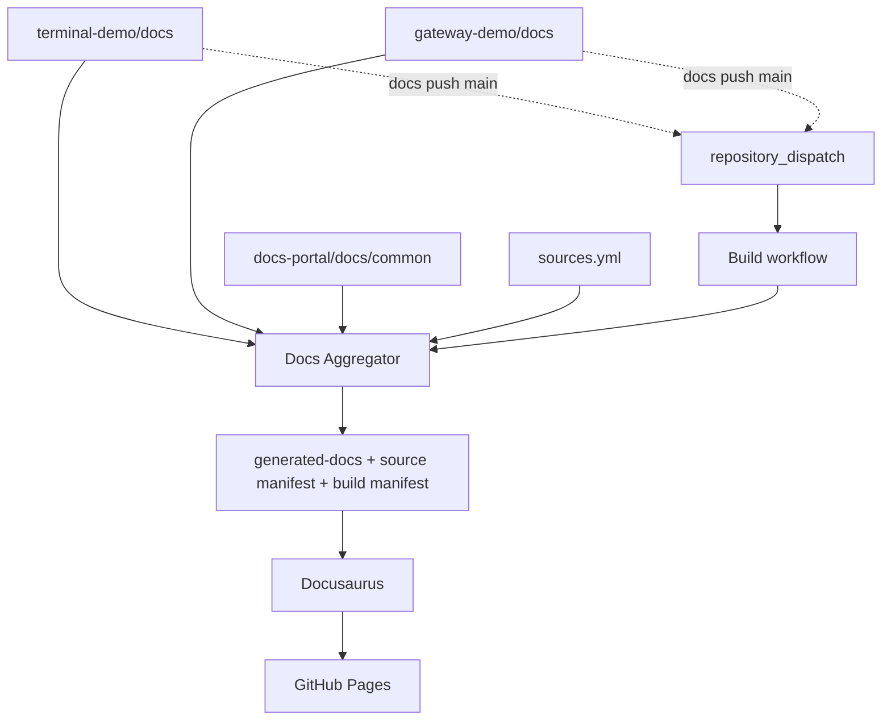
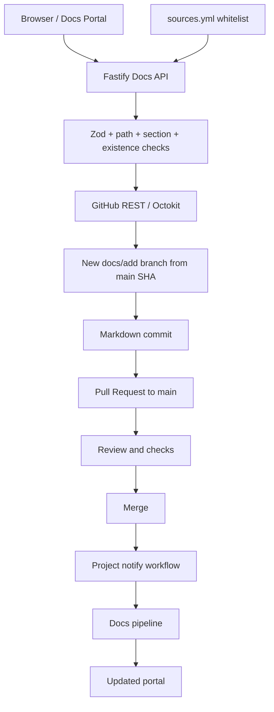
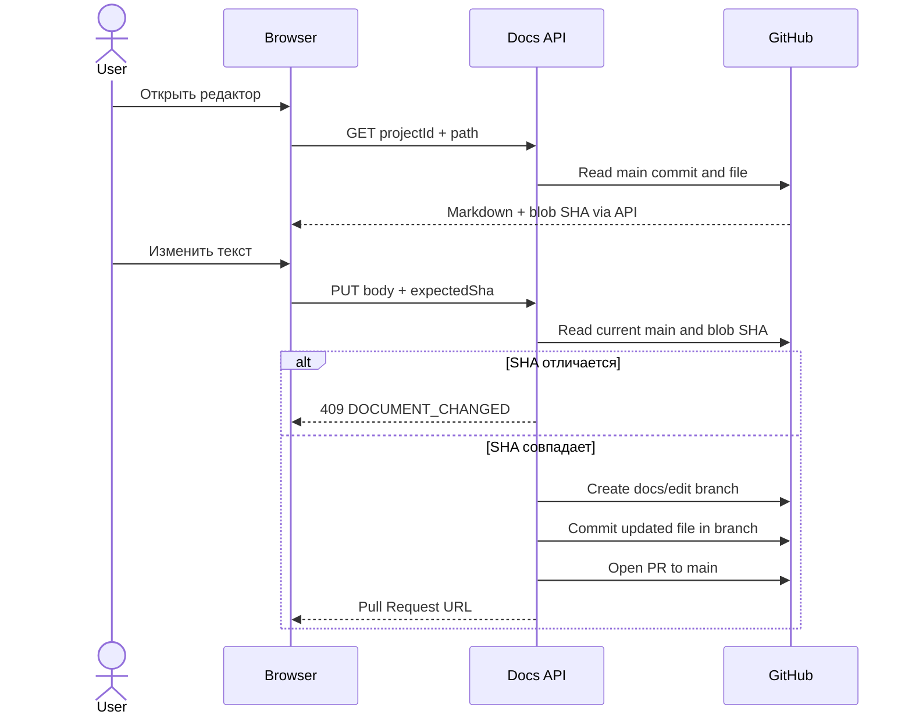

# Архитектура

## Чтение и публикация

generated-docs — временная производная, не канонический источник.
Общие документы читаются из текущего checkout, внешние — из локального каталога либо shallow clone main.

## Создание документа

## Редактирование и конфликт

PAT доступен только API или отдельным CI шагам чтения/dispatch. Браузер не получает GitHub credentials.

